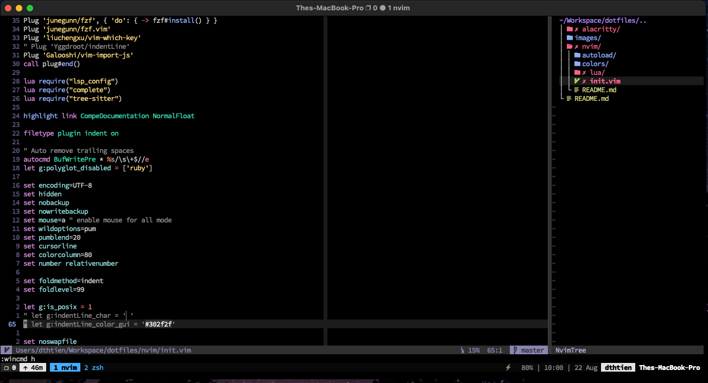

# Workspace setup
- [x] [Nvim](./nvim/README.md)
- [x] [Alacritty](./alacritty/README.md)
- [x] [Tmux](https://github.com/tmux/tmux/wiki/Installing)
- [x] [OhmyZSH](https://github.com/ohmyzsh/ohmyzsh/wiki/Installing-ZSH)

<kbd></kbd>

# References
- https://github.com/gpakosz/.tmux
- https://neovim.io/
- https://github.com/alacritty/alacritty
- https://github.com/tmux/tmux
- https://ohmyz.sh/
